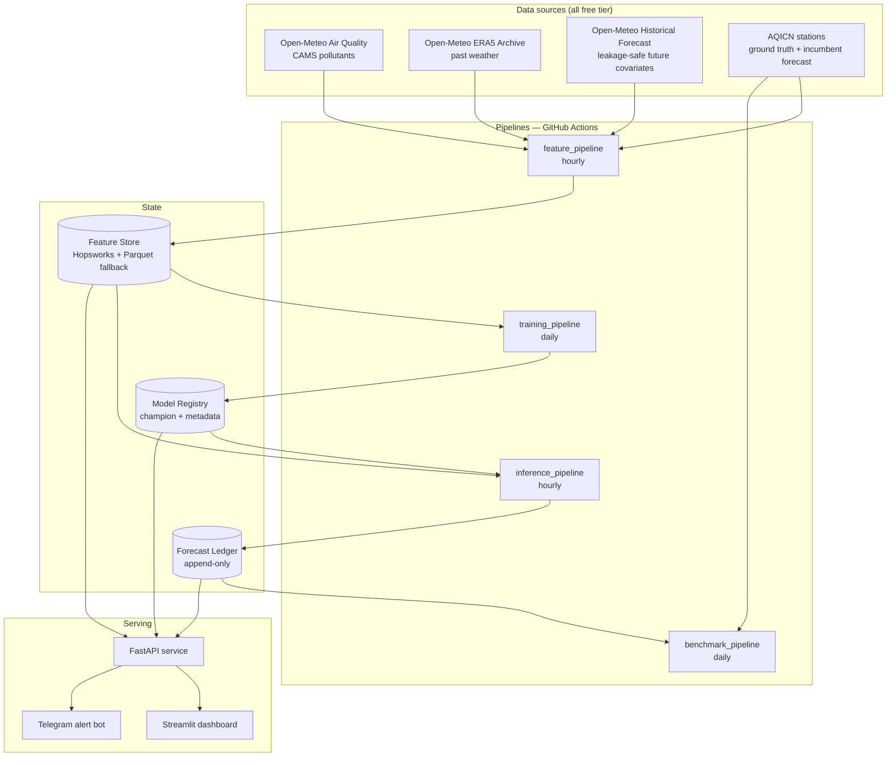

# CLAUDE.md — Pearls AQI Predictor

Operating manual for building and running this project. Read this file at the start of every
session, then `docs/STATE.md` for where the build actually is. This file defines *rules and
contracts*; `STATE.md` defines *current position*. If the two disagree, `STATE.md` is wrong.

---

## 1. What this is, and the rule that governs everything

A serverless, uncertainty-aware 3-day AQI forecasting system for Pakistani cities, which reports
where it loses and quantifies what it doesn't know.

**Pitch:** *The only AQI forecaster for Pakistan that publishes whether it beats the incumbent —
including the days it loses. Uncertainty-aware, explains itself in plain Urdu and English, runs on
$0 of serverless infrastructure.*

Note what that claims: a **method**, not a result. "Beats AQICN" is an empirical outcome you don't
own until you've measured it, and AQICN is a real NWP-driven product that may well win at D+2 and
D+3. Never stake positioning on a number you haven't got. The transparency is the contribution; the
win, if it comes, is a bonus.

### The prime directive — quality over quantity

This project is graded on evidence, not ambition. A short list of things that demonstrably work
beats a long list that mostly does. Three consequences, and they outrank every preference elsewhere
in this file:

1. **Nothing enters the build unless it is in §2 (required) or §3 (differentiating).** Everything
   else is in §4, the standing cut list.
2. **When the choice is between one more model and one more piece of evidence, take the evidence.**
   A ninth model rung adds a row to a table. A validated coverage plot changes what the report can
   claim.
3. **Adding to the cut list is progress.** Every cut earns one honest paragraph in the report's
   future-work section. That costs an afternoon and reads as judgment. Silently attempting
   everything and half-finishing it reads as inexperience.

---

## 2. Mandatory deliverables — the traceability matrix

From the assignment brief. Non-negotiable, and must be *demonstrably present*, not implied. This
table is the submission checklist.

| # | Brief requires | Lives in | Evidence |
|---|---|---|---|
| D1 | Feature pipeline: fetch raw weather + pollutant data from an external API | `src/aqi/sources/`, `pipelines/feature_pipeline.py` | Green hourly workflow run |
| D2 | Compute features and targets, incl. time-based + derived (e.g. AQI change rate) | `src/aqi/features/` | `docs/feature_spec.md` + passing schema tests |
| D3 | Store features in a Feature Store (Hopsworks / Vertex AI free tier) | `src/aqi/store/hopsworks_store.py` | Populated feature group, row count in STATE.md |
| D4 | Backfill historical (features, targets) over a range of past dates | `pipelines/backfill.py` | Full history to the CAMS floor + coverage report |
| D5 | Training pipeline: Feature Store → train + evaluate → Model Registry | `pipelines/training_pipeline.py`, `models/registry.py` | Registered champion w/ metadata |
| D6 | Scikit-learn (Random Forest, Ridge) **and** TF/PyTorch advanced models | `src/aqi/models/` | Ladder table in report |
| D7 | Evaluate with RMSE, MAE, R² | `evaluation/metrics.py` | `reports/metrics/*.json` |
| D8 | CI/CD: feature script **hourly**, training script **daily** | `.github/workflows/` | ≥7 consecutive green days |
| D9 | Web app: loads model + features from store, descriptive dashboard | `app/streamlit_app.py`, `serving/api.py` | Public URL |
| D10 | Streamlit/Gradio **and** Flask/FastAPI | Streamlit UI + FastAPI service | Both deployed, UI calls API |
| D11 | EDA to identify trends | `notebooks/01_eda.ipynb` | Rendered notebook in report |
| D12 | Variety of models — statistical → deep learning | `src/aqi/models/` | Ladder incl. SARIMAX + LSTM |
| D13 | SHAP or LIME for feature importance | `explain/shap_explain.py` | Explanation panel in dashboard |
| D14 | Alerts for hazardous AQI levels | `src/aqi/alerts/` | Working alert delivery (email default — Telegram is blocked in Pakistan by the PTA, ADR-032; Telegram itself stays supported as a channel option) |
| D15 | End-to-end system, automated pipeline, interactive dashboard, detailed report | whole repo + `reports/final_report.md` | All of the above |

**No differentiator work starts until its parent deliverable row is green.** A brilliant conformal
layer on a pipeline that was never registered in a Model Registry scores zero on D5.

**Day-one action, before any code:** confirm how this is actually scored. If the rubric is the
bullet list above, §3 is worth close to zero marks and should be trimmed to whatever fits after §2
is green. If the rubric has a "goes beyond the brief" component, §3 is worth more than the baseline
work. One email to the instructor changes the whole plan. Send it.

---

## 3. The four differentiators

These make the project not the fiftieth identical AQI repo. All four are cheap — none is a model
rung. The expensive things are in §4, cut.

1. **Predict episodes, not numbers.** Average RMSE is dominated by boring days. Publish
   precision/recall/**lead time**/false-alarm rate for hazardous events. → `evaluation/episodes.py`
2. **Quantify uncertainty.** Every forecast is an interval and a probability, never a bare number.
   "72% chance AQI exceeds 200 on Friday" is the product. → `evaluation/conformal.py`
3. **Benchmark against the incumbent, publicly** — including the days you lose. →
   `pipelines/benchmark_pipeline.py`. Depends entirely on §6; start it first.
4. **Engineer for Punjab smog physics.** Inversion proxy, stagnation index, crop-burning window,
   festival calendar. Generic global models don't have these. → `features/physics.py`

Plain-language SHAP briefings in Urdu and English (`explain/briefing.py`) support #1 and #2 rather
than standing alone — build them once the metrics they narrate exist.

---

## 4. What this project deliberately does not build

Decided, not deferred. Do not silently re-add these. Each gets one paragraph in the report's
future-work section.

| Cut | Why |
|---|---|
| Ladder rungs past LSTM — N-HiTS, TFT, Chronos, TimesFM | Highest time cost, lowest marginal marks. GBDT will almost certainly be champion anyway. |
| The full ladder on hourly horizons | The ladder is evaluated on **daily** targets only (§9). Only the champion gets an hourly variant, to drive the fan chart. Cuts ~60% of training and evaluation surface and loses nothing that is scored or demoed. |
| Drift-*triggered* automatic retraining | Another workflow to keep green, another failure surface, and it will almost certainly never fire inside the submission window. |
| Evidently drift dashboard | P2. If §17 Stage 4 finishes early, one weekly HTML report. Not in the brief. |
| OpenAQ as second ground truth | AQICN is sufficient for the divergence analysis. |
| More than two forecast zones | See §8.2 — Islamabad and Rawalpindi are probably one CAMS cell. Two *genuinely distinct* zones is the honest maximum. |
| The dashboard map page | Six pages is three too many. Cut map, cut anything else that doesn't answer a question in the demo script. |
| Hyperparameter search beyond a small fixed grid | Days of compute for decimal places nobody reads. |

---

## 5. Hard invariants — never violate these

Breaking one invalidates every number downstream. Treat a violation as a build-breaking bug.

**I1 — No temporal leakage. Ever.** When issuing a forecast at time `T` for target `T+h`, the
feature vector may contain only (a) observations timestamped `≤ T`, and (b) forecast covariates **as
issued at or before `T`**. Using ERA5 *actuals* for the window after `T` is leakage and inflates
metrics into fiction. This is why the historical-forecast archive exists (§8). Enforced by
`tests/test_no_leakage.py` — never skipped, never weakened.

**I2 — Time-ordered splits only.** No `shuffle=True`, no `train_test_split` on rows, no k-fold.
Expanding-window walk-forward with a **purge gap ≥ 72h** so overlapping target windows can't bleed.
The test period must contain a full smog season (Oct–Feb); episode metrics measured on summer air
are meaningless.

**I3 — Every forecast is written to the ledger at issue time.** You cannot retroactively obtain
AQICN's past forecasts or your own. See §6 and §11.3. A missed day is unrecoverable data loss —
higher severity than a training failure.

**I4 — Never claim a benchmark you didn't capture.** No backfilled AQICN forecasts, no reconstructed
"what our model would have said". The scorecard covers exactly the ledger window, stated explicitly.

**I5 — Report numbers are generated, never typed.** Every figure in the report and dashboard is read
from a committed artifact in `reports/metrics/`. Hand-typed numbers drift and become lies.

**I6 — Baselines are first-class.** Persistence, seasonal-naive, climatology and AQICN are evaluated
on the identical window as every ML model, in the same table. If a baseline wins at some horizon,
that is the reported result. A ladder where the simple model sometimes wins reads as mature.

**I7 — Timezone discipline.** Store and compute **UTC**; display **Asia/Karachi**. Calendar-day
boundaries for daily targets, episodes and alerts are **local**. A naive datetime entering the store
is a bug.

**I8 — Units and AQI conversion are explicit.** Concentrations in µg/m³. AQI is *computed by us* via
a documented method (§9.2), never trusted blindly from a provider. Any comparison of our AQI to a
provider's must state whether the gap is a *forecast* difference or a *conversion* difference.

**I9 — Secrets in env vars and GitHub Secrets only.** Never in code, YAML, notebooks or a committed
`.env`. Rotate anything ever pasted into a notebook output.

**I10 — Degrade, never crash.** Every external dependency has a documented fallback. A dead third
party may reduce features; it must not take the dashboard down during the demo.

---

## 6. Day 0 — start the clock, before anything else

Three things in this project accrue in **wall-clock time** and cannot be bought back at any price:

- AQICN's published forecasts — not retrievable historically
- your own issued forecasts — same
- pipeline uptime — D8's evidence bar is ≥7 consecutive green days

Everything else in this build can be crashed with effort. These cannot. So they start on day one,
decoupled from the product.

`scripts/clock_starter.py` — no dependency on the feature store, a model, or any pipeline; runs on
the standard library alone so a dependency problem can never block it. One GitHub Action, **hourly**.
Two jobs:

1. Capture the current station observation per city → append to `data/ledger/observed/`
2. Capture AQICN's published forecast block → append to `data/ledger/aqicn/`, deduplicated by
   content hash so the hourly cadence still costs about one row per city per day

Commit both to the repo. That is the whole thing.

**Hourly, not daily** (ADR-002). AQICN publishes no observation history, so a once-a-day snapshot
cannot reconstruct a daily *maximum* — and daily max is the primary target (§9.1), the quantity the
episode metrics, the alerts and the benchmark all rest on.

Ship it before the repo has a feature store, a model, or a dashboard. If everything else slips a
fortnight, the benchmark still has a fortnight more history than it otherwise would. Scheduling this
behind four weeks of prerequisites is the one mistake in the project with no recovery path.

*Gate:* one green hourly run and dated files under `data/ledger/` before Stage 1 begins.

---

## 7. Architecture



Read it as: **data in → features stored → model trained → forecast issued and *recorded* → recorded
forecast scored later.** The ledger loop is what makes the honesty claim verifiable.

---

## 8. Data contracts

### 8.1 Source assignments

Settled. Do not relitigate without an entry in `docs/DECISIONS.md`.

| Purpose | Source | Why |
|---|---|---|
| Training labels + pollutant features | Open-Meteo Air Quality (CAMS) | Only free source with long, gap-free, consistent history at these coordinates |
| Backward-looking weather | Open-Meteo ERA5 Archive | What actually happened |
| **Future-dated** weather covariates | Open-Meteo **Historical Forecast** archive | Leakage-safe: forecasts as issued (I1) |
| Ground truth + divergence analysis | AQICN stations | Real instruments |
| Incumbent benchmark | AQICN's published forecast | What a citizen would otherwise use |

**The honest framing for the report:** no free dataset offers real measurements with deep history at
these coordinates, so training runs on the best consistent model reanalysis (CAMS) while real
stations (AQICN) serve as ground truth *and* benchmark — and the project **measures the disagreement
between them rather than pretending it away.**

### 8.2 Endpoints and verified constraints

```
Air quality (CAMS):     https://air-quality-api.open-meteo.com/v1/air-quality
Weather archive (ERA5): https://archive-api.open-meteo.com/v1/archive
Historical forecast:    https://historical-forecast-api.open-meteo.com/v1/forecast
Live forecast:          https://api.open-meteo.com/v1/forecast
AQICN station feed:     https://api.waqi.info/feed/geo:{lat};{lon}/?token={AQICN_TOKEN}
```

- **CAMS global history starts ~August 2022.** The European domain reaches further back but does not
  cover Pakistan. Probe the true earliest date at Stage 1 and set `BACKFILL_START` from it; don't
  invent a date.
- **CAMS global resolution is ~0.4° (~45 km).** Islamabad and Rawalpindi very likely fall in the
  **same grid cell** — verify the returned grid coordinates before presenting them as separate
  cities. Report it as a limitation; it is also precisely why the model-vs-station divergence
  analysis has value. A second zone (Lahore) must be far enough away to be a genuinely distinct cell.
- Air-quality API supports `start_date`/`end_date`, `past_days` (0–92), `forecast_days` (0–7), and
  `domains`. **Pin `cams_global` explicitly** rather than relying on `auto`, so history stays
  consistent.
- `us_aqi` and `us_aqi_pm2_5` are available — capture them, but see I8: they are a *comparison
  series*, not the target definition.
- **AQICN's JSON shape is not reliably documented — probe it at Stage 0**, write the observed schema
  to `docs/schemas/aqicn_feed.json`, and add a contract test that fails loudly if it changes. Never
  code against an assumed field path.

### 8.3 Ingestion rules

Retry with exponential backoff and jitter; a failed city never aborts the run for other cities.
Validate every response against a Pandera/Pydantic schema before it touches the store. Cache raw
responses to `data/raw/` so a transform bug never means re-hitting the API. Backfill is **chunked
and resumable** per city-month with a manifest — a multi-year pull that dies at 80% resumes, it does
not restart. Sequential city loop with sleeps; getting throttled during submission week is a
self-inflicted outage.

---

## 9. Targets and the AQI definition

### 9.1 What we predict

**Daily is primary. Hourly is a display detail.** This is the scope cut from §4 that matters most —
it removes most of the training and evaluation surface without touching anything scored.

| Family | Target | Horizons | Built for |
|---|---|---|---|
| `daily_episode` | **max** US AQI over the local calendar day | D+1, D+2, D+3 | **The full ladder.** Alerts, episode metrics, AQICN benchmark |
| `daily_episode_clf` | P(daily max AQI > 200) | D+1, D+2, D+3 | The probability headline, alert trigger |
| `hourly_path` | US AQI at `T+h`, h ∈ {6,12,24,48,72} | **champion model only** | The dashboard fan chart |

Daily-max is the citizen-relevant quantity ("is Thursday a keep-the-kids-home day?") and it is the
granularity AQICN publishes — which is what makes the benchmark a fair comparison. Track daily mean
alongside for completeness. All estimators are **direct multi-horizon** (one per horizon), which
avoids recursive error compounding and makes per-horizon evaluation natural.

### 9.2 Computing AQI

PM2.5 is the driving pollutant; overall AQI is the max across sub-indices.

- **Daily AQI** uses the **24-hour average** concentration.
- **Real-time AQI** uses the EPA **NowCast** weighting over the last 12 hours, not the raw hourly
  value.
- Implement both in `src/aqi/aqi_scale.py` as `aqi_from_24h_mean` and `aqi_nowcast`. Never let an
  ambiguous `aqi()` exist.

**EPA revised the PM2.5 breakpoints in 2024.** Approximate current values:

| Category | AQI | PM2.5 (µg/m³, 24h) |
|---|---|---|
| Good | 0–50 | 0.0–9.0 |
| Moderate | 51–100 | 9.1–35.4 |
| Unhealthy for Sensitive Groups | 101–150 | 35.5–55.4 |
| Unhealthy | 151–200 | 55.5–125.4 |
| Very Unhealthy | 201–300 | 125.5–225.4 |
| Hazardous | 301–500 | 225.5+ |

**Verify against the EPA AQI Technical Assistance Document before locking the file** and record the
revision in the report. Providers do not all use the same revision, which alone produces systematic
offsets between our AQI, Open-Meteo's `us_aqi`, and AQICN's. If you skip this, the benchmark
measures conversion mismatch rather than forecast skill — and the headline claim is poisoned.

---

## 10. Feature specification

Declared in `conf/features.yaml`, built by `src/aqi/features/`. Every feature carries a `min_lag`
stating the oldest information it may use, and the builder asserts no feature with `min_lag < h` is
used for horizon `h`. That assertion is the mechanical enforcement of I1.

**Pollutants (CAMS):** pm2_5, pm10, no2, so2, o3, co, dust, aerosol_optical_depth.

**Weather (ERA5 past / historical-forecast future):** temperature_2m, relative_humidity_2m,
dew_point_2m, wind_speed_10m, wind_direction_10m (sin/cos plus u/v), wind_gusts_10m,
surface_pressure, precipitation, cloud_cover, boundary_layer_height, shortwave_radiation,
temperature_850hPa.

**Time:** hour, day-of-week, day-of-year, month, is_weekend — cyclical features as sin/cos pairs,
never raw integers.

**Lags & rolling:** lags at 1, 3, 6, 12, 24, 48, 168 h; rolling mean/max/min/std over 6, 24, 72 h;
**AQI change rate** (Δ over 1h, 3h, 24h — explicitly required by D2); rolling `pm2_5 / pm10` ratio
(combustion vs. dust signature).

**Region-specific physics — `features/physics.py`:**

| Feature | Definition | Why it matters here |
|---|---|---|
| `inversion_proxy` | `temperature_850hPa − temperature_2m` | Positive = inversion capping the boundary layer — the mechanism behind Punjab winter smog |
| `stagnation_index` | rolling-24h low wind × high humidity × low BLH | Pollutants accumulate when air doesn't move |
| `ventilation_index` | `boundary_layer_height × wind_speed_10m` | Standard dispersion capacity metric |
| `crop_burning_season` | Oct 15 – Nov 30 flag + day-count within window | Regional stubble-burning window |
| `festival_flag` | Eid al-Fitr, Eid al-Adha, Diwali, New Year | Firecracker/traffic spikes |
| `heating_season` | Dec 1 – Feb 15 flag | Residential biomass/coal burning |
| `wind_from_sector` | one-hot of upwind sectors | Direction of the source region |

Keep the festival calendar as `conf/calendar_pk.yaml` covering the full backfill range — Islamic
dates shift ~11 days a year, so a formula will silently mis-date them.

Each physics feature must earn its place in `notebooks/03_physics_features.ipynb` via correlation
with PM2.5 spikes. Features that show nothing are documented as tried-and-rejected in the report.
That is a finding, not a failure — and it is exactly the kind of evidence the prime directive
prefers over another model.

---

## 11. Storage contracts

### 11.1 Feature store

```python
class FeatureStore(Protocol):
    def write(self, df: pd.DataFrame, group: str, version: int) -> None: ...
    def read(self, group: str, start: datetime, end: datetime) -> pd.DataFrame: ...
    def read_latest(self, group: str, n_hours: int) -> pd.DataFrame: ...
```

Primary: **Hopsworks** free tier, feature groups keyed `(city_id, timestamp_utc)` with `event_time`
set so point-in-time joins are correct. Fallback: partitioned Parquet (`city=/year=/month=`) on a
Hugging Face Dataset repo, writable from CI with a token; plain local Parquet for dev. Selected by
`FEATURE_STORE_BACKEND`. **Both implementations pass the same test suite** — the fallback is not a
nice-to-have, it is what keeps the demo alive when a free tier goes down, and it is itself the kind
of engineering judgment the report should show off. Writes are **idempotent upserts**; re-running an
hour must not duplicate rows.

### 11.2 Model registry

Hopsworks Model Registry primary; MLflow + Hugging Face Hub fallback. Every registered model carries
training window, feature-group version, git SHA, per-horizon metrics, conformal calibration
artifacts, and the champion/challenger flag. **A model without its metrics attached must not be
promoted.**

**Promotion gate, as originally specified.** Offline: a challenger replaces the champion only if it
improves the primary metric (§12.3) on the held-out test window *and* does not regress
hazardous-event recall by more than 2 points. Ledger-based promotion switches on **only once the
ledger holds ≥30 days** — before that the ledger is reported, never used for gating. Never gate on a
window longer than the project itself; a 90-day rolling ledger will not exist by submission.

**What actually gates promotion (session 5, ADR-021):** `registry.promote_champion()` is called
unconditionally on whichever model wins §12.3's substitute metric (lowest mean RMSE) — there is no
recall-regression check, no false-alarm check, and no comparison against a prior champion anywhere in
`training_pipeline.py` or `registry.py`. This is also, mechanically, a **first registration, not a
challenger swap**: no champion existed before this session's run, so the "replaces the champion only
if" comparison this paragraph describes has not actually executed even once yet. Ledger-based
promotion has not switched on either — the ledger holds under a day of history (§8), nowhere near the
30-day floor. Log every promotion decision — this part shipped as specified; `champion.json` records
`selection_rule`, `selection_value` and `promoted_at` on every call.

### 11.3 The forecast ledger — the honesty infrastructure

Append-only, one row per `(issued_at_utc, city, target_time, model_version, horizon)`:

```
issued_at_utc, city_id, target_time_utc, horizon_h, model_version,
y_pred, y_lower_50, y_upper_50, y_lower_90, y_upper_90, p_exceeds_200,
aqicn_forecast, y_true (nullable, filled later), realized_source
```

Written by the inference pipeline **at issue time** and by the benchmark pipeline capturing AQICN
the same day; `y_true` is filled later by the scoring job. Sole source for the live scorecard,
interval coverage, and every honesty claim in the report. Back it up on every write, never rewrite
history, and record downtime gaps explicitly rather than interpolating over them.

---

## 12. Model ladder and evaluation

### 12.1 The ladder

Evaluated on **daily targets** (§9.1). Each rung is evaluated on the identical split before the next
starts — this is what stops two weeks disappearing into an LSTM that never beat persistence.

| Rung | Model | Notes |
|---|---|---|
| 0a | Persistence | `ŷ = today's max`. The floor. |
| 0b | Seasonal naive | same day last week |
| 0c | Climatology | day-of-year historical mean |
| 0d | **AQICN's own forecast** | the incumbent — the benchmark that matters |
| 1 | Ridge / ElasticNet | required by D6 |
| 2 | Random Forest | required by D6 |
| 3 | SARIMAX with exogenous vars | required by D12 (statistical) |
| 4 | LightGBM / XGBoost | expect the champion here; quantile objectives too |
| 5 | LSTM/GRU (PyTorch) | required by D6 (deep learning) |

Rungs beyond this are cut (§4). Report all nine in one table on one test window. If LightGBM beats
the LSTM, say so.

### 12.2 Splits

Expanding-window walk-forward, `n_splits ≥ 5`, **purge gap = 72h**, final held-out test period
containing a complete smog season. Implemented once in `evaluation/splits.py` and used by every
model — never re-implemented inside a model module.

### 12.3 One primary metric

Everything else is diagnostic. **As originally specified**, the number meant to decide whether a
challenger ships, and the number the report was meant to lead with:

> **Median lead time on AQI > 200 episodes at D+1**, subject to two guardrails: hazardous-event
> recall ≥ persistence's recall, and false-alarm ratio ≤ 0.5 over the test window.

Why lead time rather than recall: recall answers *did the model catch it*. Lead time answers *in
time for anyone to act*. A forecast that flags Thursday's episode on Thursday morning has perfect
recall and zero value. Lead time is also where AQICN is weakest, so it is where a win is most
plausible — and if you lose on it, that is the most interesting loss in the report.

**What actually gates promotion and produced the current champion (session 5, ADR-021):** lead time
was never computed — it needs `evaluation/episodes.py` and a populated ledger, both cut alongside
conformal prediction (§14, ADR-021). The registry's champion selection instead picks whichever ladder
entry (baseline or ML, per I6) has the **lowest mean RMSE across h24/h48/h72** on the smog-season
test window — `training_pipeline.py`'s `champion_name = min(mean_rmse, key=...)`, with no guardrail
check of any kind (no recall floor, no false-alarm ceiling — neither is implemented). This is a
substitute, not a relabelling: `champion.json`'s `selection_rule` field and `ladder.json`'s
`primary_metric_note` both say so explicitly, precisely so nobody reading the registry mistakes mean
RMSE for this section's real primary metric. The mean-RMSE champion is **SARIMAX** — see §12.1's
table. Whichever session builds the episode/ledger machinery should re-run promotion under the real
rule above; that may produce a different champion, and this session's registration is not assumed
final.

### 12.4 Everything else (diagnostic)

- **Required by D7:** RMSE, MAE, R² — **per horizon**, never blended into one number.
- **MASE** as the scale-free skill measure (scaled against the naive forecast, so it reads directly
  as skill).
- **Episode metrics** (`evaluation/episodes.py`): precision / recall / F1 at AQI > 150 and > 200;
  **Critical Success Index** (standard in meteorological verification); false-alarm ratio by season;
  **Brier score + Brier Skill Score vs. climatology** with a reliability diagram — "when we said
  70%, did it happen 70% of the time?"
- **Segmented:** smog season vs. rest of year, weekday vs. weekend, by AQI band. An overall average
  hides exactly the performance people care about.

### 12.5 Conformal prediction

Use MAPIE. **Version trap:** the time-series class was `MapieTimeSeriesRegressor` in 0.x and is
`mapie.regression.TimeSeriesRegressor` in 1.x. Pin the version in `pyproject.toml` and write the
import against the pinned one; do not copy a tutorial without checking its era.

- Calibrate **separately per horizon** — D+3 intervals must be wider than D+1. A single global width
  is an instant sign the conformal layer is decorative.
- Split conformal on a time-ordered calibration set, or EnbPI for the sequential setting.
- **Marginal coverage is not enough.** Standard conformal gives 90% coverage *on average*, which can
  hide systematic under-coverage exactly during smog episodes — the regime that matters. Use
  Mondrian (group-conditional) conformal grouped by season and current-AQI band, and **report
  coverage per group**. This is the most sophisticated thing in the project; the report must explain
  it in two clear sentences.
- Validate empirical coverage on the test set and later on the live ledger. If the nominal 90%
  interval covers 71% in practice, report that and diagnose it.

---

## 13. Automation (D8)

GitHub Actions. **Make the repo public** — Actions minutes are unlimited on public repos, and it's a
portfolio piece anyway.

| Workflow | Schedule | Does |
|---|---|---|
| `clock-starter.yml` | hourly | §6 — station observation + AQICN forecast. **First workflow that exists.** |
| `feature-pipeline.yml` | hourly | Fetch → validate → engineer → upsert to store |
| `inference-pipeline.yml` | hourly | Load champion, predict, **write ledger**, publish JSON for the UI |
| `training-pipeline.yml` | daily | Retrain ladder, evaluate, gated promotion, register |
| `benchmark-pipeline.yml` | daily | Fill `y_true`, recompute scorecard |
| `alerts.yml` | 6-hourly | Evaluate alert rules, send Telegram messages |
| `ci.yml` | on PR | ruff, mypy, pytest, leakage test |

Seven workflows is the ceiling, not a target. Operational notes that will otherwise bite:

- Scheduled workflows are **queued, not guaranteed on the minute** — 10–30 minute delays are normal.
  Never write logic assuming exact-hour execution; make everything idempotent and driven by "what's
  the latest data", not "it is now 14:00".
- GitHub **disables scheduled workflows after ~60 days of repository inactivity**. Note it in the
  runbook, and plan for the post-submission state — a portfolio piece whose live URL died two months
  later has no portfolio value.
- **D8's evidence bar is ≥7 consecutive green days**, so workflows must be live at least a fortnight
  before submission to leave room for one failure. §17 puts them live in week one.
- Failure notifications (Telegram + auto-opened issue) on every workflow. Concurrency groups prevent
  overlapping runs.

---

## 14. Serving

**FastAPI** (`serving/api.py`) — the prediction service, satisfies D10. Endpoints: `/health`,
`/cities`, `/current`, `/forecast`, `/explain`, `/benchmark`, `/metrics`. Pydantic response models,
cached reads, CORS. Deploy free on Hugging Face Spaces (Docker).

**Streamlit** (`app/`) — the dashboard, satisfies D9. **Five pages, no more, as specified:**

1. **Now** — current AQI, category, health guidance, station-vs-model comparison
2. **3-day forecast** — fan chart with 50/90% bands; headline is *"72% chance AQI exceeds 200 on
   Friday"*, never a bare number
3. **Why** — SHAP panel + plain-language briefing, English/Urdu toggle
4. **Scorecard** — live us-vs-AQICN including losses; interval coverage plot
5. **Model card** — ladder table, metrics, training window

**What actually shipped (session 6) is four pages, not five — a deliberate, documented cut, not a
shortfall of this list:** Now / 3-day forecast / Why / Model card. Page 2's headline is a **plain
point forecast**, not "72% chance..." — the conformal-prediction interval/probability layer (§3,
differentiator #2) that number depends on was cut (`docs/DECISIONS.md` ADR-021). Page 4, the
Scorecard, is not built at all — the ledger holds under a day of history, and a win/loss comparison
built from that would violate I4; the Model card page states the ledger's real window instead
(ADR-027). This will read as real pages again once episode/conformal work (RUNBOOK §2.1 session 6)
and a matured ledger both exist — until then, `docs/DELIVERABLES.md` D9/D10 describe the four that
actually ship.

Deploy on Streamlit Community Cloud. The UI reads the API and **falls back to reading the store
directly** if the API is down (I10).

**Demo resilience — free tiers will fail.** Spaces and Streamlit Cloud sleep when idle, Hopsworks
flakes, free LLM tiers rate-limit. Three non-optional requirements: a `--static` mode rendering the
whole dashboard from committed JSON in `reports/`; the 3-minute video recorded a week early, not the
night before; both Spaces warmed before any live demo. And **write the demo script on day one** —
the exact three minutes you will show. Anything not in it is P2; it is the cheapest prioritization
tool available and it is what stops §4 quietly refilling.

**Explanations (`explain/briefing.py`)** — the LLM writes *prose*, never numbers. SHAP values → a
structured dict of drivers and magnitudes → strict template → LLM rephrases. Every number comes from
the dict, so hallucination is structurally impossible. Ship a deterministic template-only fallback
for when no LLM key is present; the feature must work offline. Free tier: Groq / Gemini / HF.

**Language.** Do not LLM-translate English prose into Urdu — stilted Urdu is worse than English-only
for the accessibility claim. Two rules: all fixed strings (categories, health guidance, alert
templates — roughly twenty) are hand-written once in `conf/i18n_ur.yaml` and read by a native
speaker; the briefing paragraph is generated **natively in Urdu** from the same driver dict, not
translated from the English output.

**Alerts (D14)** — originally specified: triggered on `P(AQI>200) > 0.6` rather than a point forecast
crossing 200, sent via Telegram; that was the uncertainty thesis applied to a real decision. **What
shipped instead, and why:** the probability trigger needed the conformal-prediction probability head
(§3, differentiator #2), which was cut under deadline pressure alongside episode detection
(`docs/DECISIONS.md` ADR-021) — `alerts/rules.py::evaluate()` fires on the **D+1 point forecast
crossing 200** (a plain LightGBM number, not a probability), documented as a substitute, not silently
relabelled (ADR-026). Telegram is not the default channel either: it is blocked in Pakistan by the
PTA, the market this product is for — a product finding, not a bug (ADR-032). Email
(`alerts/email_sender.py`) ships as the default; Telegram (`alerts/telegram.py`) stays supported via
`ALERT_CHANNEL=telegram`, e.g. for the maintainer's own monitoring from outside that block. The
mechanics that don't depend on the trigger — plain-language reason, deduplicate within an episode,
send an all-clear — shipped as specified, via a channel-agnostic `Notifier` Protocol.

---

## 15. Repository layout

```
.
├── CLAUDE.md · README.md · pyproject.toml · .env.example
├── scripts/clock_starter.py   # §6 — ships first
├── conf/                      # config, cities, features (+min_lag), calendar_pk, i18n_ur
├── src/aqi/
│   ├── config.py              # Pydantic settings, single source of config truth
│   ├── aqi_scale.py           # EPA breakpoints, NowCast, categories
│   ├── sources/               # open_meteo_air, open_meteo_weather, open_meteo_hist_forecast, aqicn
│   ├── features/              # builders, physics, calendar_pk, spec
│   ├── store/                 # base(Protocol), hopsworks_store, parquet_store, ledger
│   ├── models/                # baselines, linear, forest, sarimax, gbdt, deep, registry
│   ├── evaluation/            # splits, metrics, episodes, conformal, backtest
│   ├── explain/               # shap_explain, briefing, i18n
│   ├── pipelines/             # feature, backfill, training, inference, benchmark
│   ├── alerts/                # rules, telegram
│   └── serving/               # api, schemas
├── app/                       # streamlit_app.py, pages/, components/
├── notebooks/                 # 01_eda, 02_divergence, 03_physics_features, 04_model_analysis
├── tests/                     # incl. test_no_leakage, test_store_parity, test_schemas
├── .github/workflows/
├── data/ledger/               # §6 — committed, append-only
├── reports/                   # final_report.md, metrics/ (generated), figures/ (generated)
└── docs/                      # STATE.md, DECISIONS.md, RUNBOOK.md, schemas/
```

---

## 16. Conventions

Python 3.11+, `uv`, all versions pinned. **ruff** (lint + format), **mypy** on `src/`, **pytest** —
all three in CI, all three green before merge. Config via **Pydantic Settings** from env + YAML; no
magic numbers in code, so multi-city is a config change and never a code change. **Notebooks import
from `src/`, never the reverse**; clear outputs before committing. Structured logging with a run id
— print statements don't survive a CI run you need to debug at 2am. Seed everything; log seeds and
git SHA in model metadata. Conventional commits, small and focused. Never commit data, secrets or
`.ipynb` outputs.

```bash
make setup · test · lint          # uv sync; pytest incl. leakage test; ruff + mypy
make clock                        # §6 — AQICN snapshot + realized values
make backfill CITY=islamabad      # resumable, chunked
make features · train · predict   # one hourly run; full ladder; inference + ledger write
make benchmark · report           # score ledger; regenerate all figures + metrics
make api · app                    # uvicorn; streamlit
```

---

## 17. Build sequence — vertical slices, not horizontal layers

The failure mode this replaces is horizontal: all features, then all models, then all automation,
then all UI — which arrives at submission with everything 70% finished and nothing demonstrable.
Build vertically. Every stage below ends with something that **runs end to end**, and every later
stage thickens a layer rather than adding a new one. Each stage ends with a `STATE.md` update.

**Stage 0 — Start the clock (half a day).** §6, plus the rubric email in §2, plus `make probe` to
settle the §8.2 open questions (grid-cell collision, CAMS history floor, AQICN schema). Nothing else
begins first.
*Gate:* green hourly clock-starter run, dated files in `data/ledger/`, probe findings recorded in
`STATE.md`.

**Stage 1 — The ugly slice (week 1).** One city. One horizon (D+1 daily max). Persistence only.
Local Parquet. A hard-coded Streamlit page showing one number. `aqi_scale.py` written and unit-tested
against known EPA examples. One GitHub Action running the lot daily. It will be embarrassing; ship
it anyway — from here you always have something that works, and every later cut is a cut to quality
rather than to existence.
*Gate:* a public URL showing today's D+1 persistence forecast, updated by CI with no hands.

**Stage 2 — Make the data real (week 2).** All four sources, schemas captured to `docs/schemas/`,
full feature builder incl. physics features, validation suite, resumable backfill to the CAMS floor,
Hopsworks + Parquet passing identical store-parity tests. Hourly feature workflow live.
*Gate:* populated feature store, coverage report showing where the gaps are, hourly workflow green.

**Stage 3 — Make the model honest (weeks 3–4).** EDA and divergence notebooks. All four baselines on
the real split. Then ladder rungs 1–5, per-horizon metrics, episode metrics, conformal intervals
with per-group coverage, gated registration. Daily training workflow live; inference writes the
ledger.
*Gate:* a registered champion beating persistence on the §12.3 primary metric, with coverage
validated — and the baseline table published whether or not the champion wins.

**Stage 4 — Make it usable (week 5).** FastAPI service, the five dashboard pages, SHAP panel,
briefing layer with the Urdu rules from §14, Telegram alerts, `--static` mode, both deployments.
*Gate:* a stranger can open a public URL and see a live forecast with intervals and a live scorecard.

**Stage 5 — Make it defensible (week 6).** Report, README, demo video recorded early. If — and only
if — this stage has slack, spend an afternoon showing the dashboard to five Rawalpindi residents and
put their reactions in the report. Five real reactions are worth more than a sixth model rung, and
almost no student project has any user contact at all.
*Gate:* report complete, all tables generated from `reports/metrics/`, video recorded.

Slack is not optional. If a stage runs long, the response is to cut from §3 into §4 — never to
compress Stage 5, and never to delay Stage 0.

---

## 18. The report (D15)

Not a Stage-5 artifact. **Start it at Stage 0 and write it as you go** — it is 25% of the brief's
final submission and the thing that outlives the code. Every decision goes into `DECISIONS.md` the
day it's made, and the report assembles from there.

1. Problem, and why it matters here specifically
2. System architecture (§7 diagram)
3. Data sources and the honest CAMS-vs-station tradeoff (§8.1)
4. Feature engineering, physics features and their evidence — including the rejected ones
5. The ladder, and the full comparison table on one window
6. **"How well does the model warn about bad days?"** — episode metrics. Give it that title; it is
   the section that distinguishes this project.
7. Uncertainty: conformal method, coverage per group, what the intervals mean in practice
8. Live benchmark vs. AQICN over the exact ledger window — wins *and* losses
9. Model-vs-station divergence analysis
10. Automation and observed uptime
11. Limitations
12. What I'd do next — including every line of §4, one paragraph each

**On users, be exact.** If you did the Stage-5 conversations, report what people said. If you
didn't, write that the citizen framing was a design constraint rather than a validated need. Do not
claim users you don't have; an experienced reader spots it immediately and it costs more credibility
than the feature was worth.

The limitations section is not a weakness to minimise. A clear-eyed account of what the system
cannot do is the strongest available signal that the numbers in the other sections are real.

---

## 19. Session protocol

**Starting:** read `docs/STATE.md` — current stage, what's in flight, known breakage. Then check
pipeline health: were the last runs green, is the ledger still growing? **A broken pipeline outranks
whatever was planned for the session** — especially the clock-starter, whose losses are permanent.
Then confirm the stage gate you're working toward.

**During:** small commits; `docs/DECISIONS.md` gets an entry whenever a real choice is made (chosen,
rejected, why); when a number changes, regenerate the artifact rather than editing prose.

**Ending:** update `docs/STATE.md` with what moved, what broke, and the single next action. Leave
the repo green — never end on a failing test with no note.

---

## 20. Anti-patterns

- **Building horizontally.** All layers at 70% on submission day. §17 exists to prevent this.
- **Starting the clock late.** Uptime and ledger history are wall-clock and cannot be backfilled.
  The one mistake with no recovery.
- **Believing metrics that look too good.** A sudden RMSE drop means leakage until proven otherwise.
  Go and check I1.
- **Re-adding cut scope** because a tutorial made it look easy. §4 is a decision, not a wishlist.
- **Evaluating on summer.** Clean-air months make episode recall meaningless.
- **Collapsing detail into one number** — a single interval width across every horizon, or metrics
  averaged across them. The first says the conformal layer is decorative; the second hides
  everything worth knowing.
- **Polishing the dashboard before the model is honest.** Stage 1's ugly page is the point; a
  *beautiful* UI over leaky numbers is worse than no UI.
- **Letting the LLM state numbers.** It will eventually invent one, in the demo.
- **Skipping the boring deliverables** — Feature Store registration, Model Registry, the report —
  because the differentiators are more fun. §2 is scored; §3 is what's remembered. Both, in that
  order.
- **Hiding a loss to AQICN.** The transparency *is* the contribution. A scorecard showing 60/40 with
  an explanation of when and why you lose is far stronger than an unverifiable claim of superiority.
