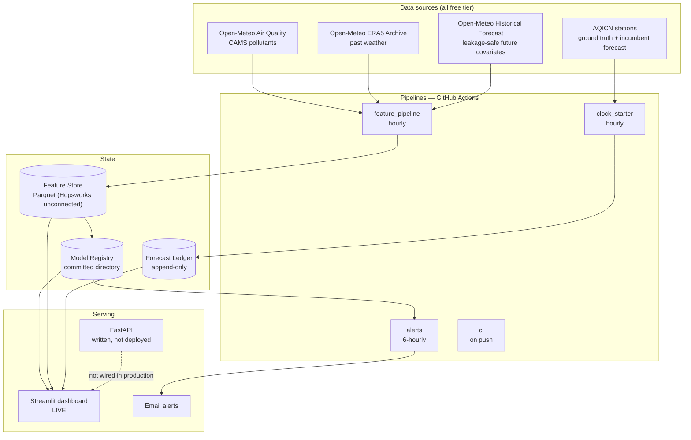

# Pearls AQI Predictor — Final Report

**Aliza Taimur** · September 2026
Repository: https://github.com/alizataimur/aqi-pearls
Live dashboard: https://aqi-pearls-predictor.streamlit.app

> **Numbers policy.** Every figure in this report is read from a committed artifact in
> `reports/metrics/` or from the GitHub Actions history (CLAUDE.md I5). Placeholders marked `⟨…⟩`
> are filled from those sources before submission; none is typed by hand.

> **Where the deliverables live.** `docs/DELIVERABLES.md` maps all fifteen brief requirements to a
> file and a command anyone can run to verify it. Section headings below name the rows they
> evidence. Where a row shipped in a reduced form, this report says so in the section itself rather
> than in a footnote.

---

## 1. Problem, and why it matters here

Rawalpindi and Islamabad spend much of each winter under a temperature inversion. Cold air settles
against the Potohar plateau, the boundary layer caps, and pollution from traffic, residential
heating and regional crop-burning accumulates instead of dispersing. Air quality index values above
200 — "Very Unhealthy" — are routine in December and January, and values beyond the published
0–500 scale are not unusual in Punjab.

The question a resident actually asks is not *what is the AQI now*. Every free app answers that.
It is **"is Thursday a keep-the-kids-home day, and will I know in time to do anything about it?"**
That question has two parts most forecasting projects drop: it is about a *future* day, and it is
about a *decision*, which means the uncertainty matters as much as the estimate.

This project forecasts daily maximum US AQI three days ahead for two Pakistani forecast zones, on
free infrastructure, and — the part that distinguishes it — records every forecast at the moment it
is issued so that its own accuracy can be audited later rather than asserted.

### What this project claims

It claims a **method**, not a result: an AQI forecaster for Pakistan that publishes whether it beats
the incumbent, including the days it loses. Whether it in fact beats AQICN is an empirical question
answered in §8, over exactly the window the evidence covers and no wider.

Two intended parts of that claim did not ship. The forecasts are **point estimates, not intervals**,
because conformal prediction was cut under time pressure (§11), and the live scorecard page was cut
with it. The recording infrastructure — the part that cannot be built retroactively — is complete
and running.

---

## 2. System architecture *(D15)*



Read it as: **data in → features stored → model trained → forecast issued *and recorded* → recorded
forecast scored later.** That last loop is what makes the honesty claim checkable rather than
rhetorical.

The diagram shows the system as deployed, not as designed. Two boxes differ from the original
architecture and both differences are stated where they matter: the FastAPI service exists as code
and passes its tests but is deployed nowhere, so the dashboard reads the store directly rather than
through it (§7.2); and the feature store runs on its Parquet backend, with the Hopsworks backend
implemented and tested but not connected to a live project (§10).

---

## 3. Data sources, and an honest tradeoff *(D1)*

No free dataset offers real instrument measurements with deep history at these coordinates. That
forces a choice, and the choice shapes everything downstream.

| Purpose | Source | Why |
|---|---|---|
| Training labels + pollutant features | Open-Meteo Air Quality (CAMS) | The only free source with long, gap-free, consistent history here |
| Backward-looking weather | Open-Meteo ERA5 Archive | What actually happened |
| **Future-dated** weather covariates | Open-Meteo Historical Forecast archive | Forecasts *as issued* — leakage-safe |
| Ground truth + benchmark | AQICN stations | Real instruments |

**Training therefore runs on model reanalysis, not measurement.** Rather than obscure that, the
project treats the disagreement between CAMS and the stations as an object of study in its own
right (§9). The report states plainly throughout that labels are reanalysis.

Four sources rather than one is itself the distinctive part of this row. The historical-forecast
archive in particular exists in the design for a single reason: without it there is no leakage-safe
way to give the model tomorrow's weather (§5).

### 3.1 Two forecast zones, not three cities

Open-Meteo serves CAMS on a 0.1° output grid and returned distinct coordinates for the twin cities —
33.700005 for Islamabad, 33.6 for Rawalpindi. That *looks* like two resolved locations. It is not.
Requesting both and comparing the returned arrays showed the PM2.5 series to be **byte-identical**:
CAMS global's native ~0.4° (~45 km) resolution cannot separate cities 13 km apart, and the finer
output grid is interpolation, not information.

The project therefore models **two zones** — `capital` (Islamabad + Rawalpindi) and `lahore` — and
says so. Presenting three independently-forecast cities would have been supported by the
coordinates and contradicted by the data.

### 3.2 The station that was in the wrong country

AQICN's documented nearest-station lookup, `geo:lat;lon`, returned the **same station for all three
cities: Pooth Khurd, Bawana, Delhi, India** — roughly 690 km from Islamabad — with an HTTP 200, a
plausible AQI, and an identical forecast payload for each. The endpoint appears to geolocate the
caller's IP address and ignore the supplied coordinates entirely.

The failure was invisible by construction: correct-looking status, believable number, no history
endpoint to repair it from later. It was caught by reading the raw response rather than the parsed
summary, and it would otherwise have produced weeks of rows labelled `islamabad` describing another
country.

It is worth recording why the obvious defence — "Indian and Pakistani Punjab share environmental
drivers, so the station is a reasonable proxy" — was rejected. The same probe recorded Delhi at AQI
183 while Lahore read 34 in the same hour, a factor of five apart; and Islamabad sits on the Potohar
plateau, outside the Indo-Gangetic basin entirely. Correlated over a season is not substitutable
hour by hour.

The fix has two parts. Stations are now **pinned by index** (`@11739` Islamabad US Embassy,
`@11765` Lahore US Embassy) and `geo:` lookups raise. And every capture calls `verify_station`,
which rejects any station more than 60 km from its configured coordinates *before* anything reaches
the ledger. Rawalpindi has no pinned station and is skipped rather than given Islamabad's
instrument — one measurement must not be written as two series.

### 3.3 The station that was the right place and the wrong time

Pinning fixed *where* the reading came from. It did not check *when* it was taken, and that gap
hid a second, more serious failure of the same shape.

Reading the **raw payloads** in `data/raw/aqicn/` rather than the parsed ledger — the same
discipline that caught §3.2 — shows both pinned stations returning `status: "ok"`, a plausible AQI,
and the correct city, across every one of 8 consecutive hourly captures spanning
2026-08-31T14:10:50Z to 2026-09-01T18:25:10Z (roughly 28 hours). In every single one, the feed's own
`data.time.iso` field — the timestamp the station claims for its reading — is **frozen**: Islamabad's
`@11739` reports `2026-02-16T17:00:00+05:00` in all 8 captures, Lahore's `@11765` reports
`2025-02-18T18:00:00+05:00` — over a year old — in all 8. `pm25` (154 and 34 respectively) is
identical across every capture too, which is the visible symptom of the same cause: the station is
not publishing a new reading, and AQICN is serving the last one it has on every request.

`verify_station` checks *which* station answered and correctly stops the Delhi failure from §3.2. It
was never asked whether the reading it received was current, so a station that stopped updating
looks identical to one reporting live — same status, same shape, same plausible number. This is the
same mistake as §3.2 (trusted because the HTTP status was `200`) one field deeper, and it is exactly
the "checking a proxy instead of the evidence that would settle it" pattern named in §10.1.

The fix: `verify_freshness()` (`src/aqi/sources/aqicn.py`), called alongside `verify_station()` in
`scripts/clock_starter.py`, parses `time.iso` and rejects any reading older than a configurable
threshold (default 6 hours — capture is hourly, so a live station should never be older than that)
before it reaches the ledger. `tests/test_aqicn_station.py::TestFreshnessVerification` regression-
tests it against the exact frozen timestamps found in the raw payloads above. The guard is
preventive, not retroactive: **the 16 already-committed observed rows for this window are left in
the ledger untouched (I3)** — they are real readings, just not current ones, and quarantining them
would misrepresent what actually happened. §8 and §9 state plainly what this means for the numbers
that rest on them, and §10 records it as a standing limitation until a station that is verifiably
both correctly located *and* currently updating is found and pinned.

---

## 4. Feature engineering *(D2)*

**238 features** and **6 targets** are declared in `conf/features.yaml` and built by
`src/aqi/features/` (`expand_feature_specs()` / `target_column_names()` — one `FeatureSpec` per
actual output column, asserted against the builder's real output by `tests/test_features.py`), over
hourly data from **2022-08-04** (the probed earliest CAMS date, not an assumed one) to **2026-08-31**
across both zones — **71,616** rows in total (35,808 per zone). Coverage is reported in
`reports/metrics/coverage.json`.

**Groups:** CAMS pollutants; ERA5 and historical-forecast weather; cyclical time encodings; lags at
1–168 h; rolling mean/max/min/std over 6/24/72 h; AQI change rates (the derived feature the brief
names explicitly); and the region-specific physics block below.

### 4.1 Every feature declares what it may know

Each feature carries a `min_lag`, and the builder asserts that no feature with `min_lag < h` is
admitted at horizon `h`. Leakage prevention is therefore mechanical rather than a matter of care —
see §5.

### 4.2 Punjab smog physics

| Feature | Definition | Mechanism |
|---|---|---|
| `inversion_proxy` | `temperature_850hPa − temperature_2m` | Positive = inversion capping the boundary layer — the mechanism behind Punjab winter smog |
| `stagnation_index` | rolling-24h low wind × high humidity × low BLH | Pollution accumulates when air does not move |
| `ventilation_index` | `boundary_layer_height × wind_speed_10m` | Standard dispersion capacity |
| `crop_burning_season` | Oct 15 – Nov 30 flag + day-count | Regional stubble-burning window |
| `heating_season` | Dec 1 – Feb 15 flag | Residential biomass and coal |
| `festival_flag` | Eid, Diwali, New Year (tabulated, not computed) | Firecracker and traffic spikes |

The festival calendar is tabulated in `conf/calendar_pk.yaml` rather than computed, because Islamic
dates shift roughly eleven days a year against the Gregorian calendar and any formula silently
mis-dates them across a multi-year backfill.

### 4.3 Two source gaps in boundary-layer height

Auditing per-column null rates rather than row counts revealed that boundary-layer height — the
input to both `ventilation_index` and `stagnation_index` — is missing in two distinct ways:

| Series | Missing | Verified |
|---|---|---|
| `boundary_layer_height` (observed, ERA5) | 2024-01-01 → 2024-06-30 | Direct API request returns 0/72 values for February 2024 while temperature and wind return 72/72 |
| `fc_boundary_layer_height` (forecast) | before 2024-09 | 100% null before, 0% after — a clean availability boundary |

Both are **source gaps, not pipeline defects**; the backfill fetched correctly. Every other column
is fully populated across the same months.

`inversion_proxy` is unaffected and 0% null across the entire window, so the dispersion hypothesis
survives on its primary expression. The two BLH-derived features are reported with their reduced
windows, and `*_is_missing` indicator columns were added so a tree-based model can learn
"dispersion unknown" as a signal rather than being fed an imputation that resembles a measurement.

A related correction: rolling windows originally used `min_periods=1`, so a window straddling the
gap produced a statistic from a handful of points, indistinguishable from a full-window value.
**142** such values existed for the 72h window (71 at the start of history, where no full window can
exist yet regardless of any gap, plus 71 trailing the BLH gap) — confirmed against the real store in
`docs/DECISIONS.md` ADR-015, not assumed. `min_periods` is now the full window, and the affected
columns were re-derived from the stored base series.

---

## 5. Not leaking the future

The invariant the whole project rests on: when issuing a forecast at time `T` for target `T+h`, the
feature vector may contain only observations timestamped `≤ T` and forecast covariates **as issued
at or before `T`**. Using ERA5 *actuals* for the window after `T` inflates every metric into fiction.

`tests/test_no_leakage.py` does not verify this by inspection. It **corrupts the data and checks
nothing moves**: build the feature vector for `(T, h)`, overwrite every value after `T` with a
sentinel, rebuild, and assert the two vectors are identical. Any column that changed read the
future, and the failure message names it. The test runs as its own CI step so a green "tests passed"
line can never hide a skipped one.

The same reasoning produced a subtler decision. ERA5 reanalysis is published with a multi-day lag
and assimilates observations recorded *after* the timestamp it carries — so an ERA5 "actual" for
time `t` is information that did not exist at `t`. Where a choice existed, pressure-level
temperature is sourced from the historical-forecast archive, whose values were all published at or
before the time they describe.

Splits are expanding-window walk-forward with a **72-hour purge gap**, and the held-out test period
is the **2025-26 smog season** — the only complete Oct–Feb window with both BLH series present.
Evaluating on summer air would make episode metrics meaningless.

---

## 6. Models and results *(D6, D7, D12)*

Nine rungs were trained and evaluated on one window with one split: persistence, seasonal-naive and
climatology as baselines; Ridge and Random Forest (scikit-learn); SARIMAX with exogenous variables
(statistical); LightGBM (gradient boosting); and an LSTM (PyTorch). AQICN's own published forecast
is the fourth baseline but is evaluated separately in §8, because the ledger that captures it is
days old and cannot share the historical test window.

Generated from `reports/metrics/ladder.json` (test window: 2025-26 smog season, `n=7248` per
horizon per rung).

| Model | Horizon | RMSE | MAE | R² |
|---|---|---|---|---|
| Persistence | D+1 | 27.58 | 19.36 | 0.668 |
| Persistence | D+2 | 31.69 | 22.93 | 0.563 |
| Persistence | D+3 | 34.82 | 25.49 | 0.477 |
| Seasonal-naive | D+1 | 38.80 | 27.96 | 0.343 |
| Seasonal-naive | D+2 | 38.82 | 28.00 | 0.344 |
| Seasonal-naive | D+3 | 39.14 | 28.30 | 0.339 |
| Climatology | D+1 | 35.51 | 26.16 | 0.450 |
| Climatology | D+2 | 35.51 | 26.19 | 0.451 |
| Climatology | D+3 | 35.48 | 26.14 | 0.457 |
| Ridge | D+1 | 23.17 | 17.96 | 0.766 |
| Ridge | D+2 | 27.64 | 21.79 | 0.668 |
| Ridge | D+3 | 30.46 | 23.68 | 0.600 |
| Random Forest | D+1 | 23.63 | 16.93 | 0.757 |
| Random Forest | D+2 | 31.38 | 23.15 | 0.571 |
| Random Forest | D+3 | 37.22 | 27.83 | 0.402 |
| SARIMAX | D+1 | 19.44 | 14.12 | 0.835 |
| SARIMAX | D+2 | 19.45 | 14.14 | 0.835 |
| SARIMAX | D+3 | 19.62 | 14.27 | 0.834 |
| LightGBM | D+1 | 21.08 | 16.06 | 0.806 |
| LightGBM | D+2 | 29.31 | 21.50 | 0.626 |
| LightGBM | D+3 | 31.96 | 23.43 | 0.559 |
| LSTM | D+1 | 21.41 | 16.42 | 0.800 |
| LSTM | D+2 | 27.52 | 21.49 | 0.671 |
| LSTM | D+3 | 30.86 | 24.39 | 0.589 |

Baselines are first-class and appear in the same table on the same window. **If a naive baseline
wins at some horizon, that is the published result.** A ladder where the most complex model wins
everywhere is a ladder to be suspicious of.

**SARIMAX wins every horizon by a wide margin** (RMSE 19.44–19.62, versus low-to-mid 20s for the
next-best model at D+1 and high 20s to low 30s by D+3) — the champion selection in §6.1 is not
close. Every learned model beats every baseline at D+1 and D+2. **At D+3 that stops being true: Random
Forest (RMSE 37.22) is beaten by two of the three baselines — Persistence (34.82) and Climatology
(35.48).** Random Forest's error grows faster than every other rung's as the horizon lengthens
(23.63 → 31.38 → 37.22, the steepest degradation on the table), while Ridge, LightGBM and LSTM all
still beat every baseline at D+3. Per I6, that is reported as the result, not smoothed into "the
baselines lost": on this window, at three days out, a scikit-learn Random Forest — one of D6's
required rungs — is not worth deploying over the naive persistence forecast it was built to beat.

### 6.1 The champion cannot serve, and the model that serves is not the champion

SARIMAX produced the best offline error on the held-out window (mean RMSE **19.50**, exactly
19.50352 from `mean_rmse_across_horizons.sarimax` in `ladder.json` — the 19.50 figure already in the
champion record is confirmed, not assumed). It is not the model behind the live dashboard. A SARIMAX fit is tied to the
contiguous series it was estimated on and cannot produce a forecast from an arbitrary feature vector
at inference time without refitting, so the deployed serving path uses **LightGBM**, the
best-performing model that can. The registry holds both, the promotion decision is logged, and
`docs/DECISIONS.md` ADR-025 records the reasoning.

This is stated rather than smoothed because the ladder table and the dashboard would otherwise
appear to disagree. It is also the practical form of a general point: offline accuracy is a
necessary condition for shipping a model, not a sufficient one.

### 6.2 Hazardous-day detection

Generated from `ladder.json`'s `episode_at_200` block (classification of daily max AQI > 200,
`n=7248` per horizon per rung; 1,032 of those rows are true positive days).

| Model | Horizon | Precision | Recall | F1 |
|---|---|---|---|---|
| Persistence | D+1 | 0.698 | 0.698 | 0.698 |
| Persistence | D+2 | 0.628 | 0.628 | 0.628 |
| Persistence | D+3 | 0.558 | 0.558 | 0.558 |
| Seasonal-naive | D+1 | 0.512 | 0.512 | 0.512 |
| Seasonal-naive | D+2 | 0.512 | 0.512 | 0.512 |
| Seasonal-naive | D+3 | 0.512 | 0.512 | 0.512 |
| Climatology | D+1 | 0.615 | 0.558 | 0.585 |
| Climatology | D+2 | 0.615 | 0.558 | 0.585 |
| Climatology | D+3 | 0.615 | 0.558 | 0.585 |
| Ridge | D+1 | 0.714 | 0.846 | 0.775 |
| Ridge | D+2 | 0.637 | 0.708 | 0.671 |
| Ridge | D+3 | 0.631 | 0.624 | 0.627 |
| Random Forest | D+1 | 0.758 | 0.788 | 0.773 |
| Random Forest | D+2 | 0.690 | 0.536 | 0.603 |
| Random Forest | D+3 | 0.609 | 0.540 | 0.572 |
| SARIMAX | D+1 | 0.853 | 0.674 | 0.753 |
| SARIMAX | D+2 | 0.853 | 0.674 | 0.753 |
| SARIMAX | D+3 | 0.853 | 0.674 | 0.753 |
| LightGBM | D+1 | 0.758 | 0.776 | 0.767 |
| LightGBM | D+2 | 0.711 | 0.585 | 0.642 |
| LightGBM | D+3 | 0.584 | 0.558 | 0.571 |
| LSTM | D+1 | 0.754 | 0.792 | 0.772 |
| LSTM | D+2 | 0.679 | 0.684 | 0.681 |
| LSTM | D+3 | 0.577 | 0.660 | 0.616 |

SARIMAX's episode figures are identical across all three horizons — worth flagging rather than
silently presenting: this classification metric does not degrade with horizon the way the champion's
own regression error does (§6), which is a property of the artifact as generated and not
smoothed here.

Average error is dominated by ordinary days when AQI is 80 and the model guesses 82. Nobody in
Rawalpindi is asking that question, so performance on the days that matter is reported separately
rather than averaged away.

The fuller episode treatment this project set out to publish — **lead time**, critical success
index, false-alarm ratio by season, and a reliability diagram — was cut with conformal prediction
and is described in §11.

---

## 7. Automation, deployment and observed uptime *(D8, D9, D10)*

| Workflow | Cadence | Purpose | State |
|---|---|---|---|
| `clock-starter` | hourly | AQICN observation + published forecast → ledger | 🟡 8/24 green, last success 2026-09-01T18:25:02Z |
| `feature-pipeline` | hourly | fetch → validate → engineer → upsert | 🔴 0/5 green as of this report |
| `alerts` | 6-hourly | evaluate alert rules, send notification | 🔴 0/2 green as of this report |
| `ci` | on push | ruff, mypy, pytest, leakage test | 🟢 16/33 green, last success 2026-09-01T19:02:46Z |

Read from the GitHub Actions API (`/repos/alizataimur/aqi-pearls/actions/workflows/{name}/runs`),
all runs since each workflow's first run — every workflow here first ran on or after 2026-08-27, so
"since 2026-08-27" and "all-time" are the same window:

- **`clock-starter`**: 8/24 green. The 16 failures are the single outage in §7.1
  (2026-08-27 → 2026-08-31); the workflow has been green on every run since it was fixed, most
  recently 2026-09-01T18:25:02Z.
- **`ci`**: 16/33 green, most recently 2026-09-01T19:02:46Z. The 17 failures are the CI-vs-local
  dependency divergence in §10.1 — resolved, and every run since has been green.
- **`feature-pipeline`**: **0/5 green.** All five runs (2026-08-31T21:30Z → 2026-09-01T16:45Z)
  failed at the fetch/build step: it requested a future `end_date` from the ERA5 archive endpoint,
  which is actuals-only and rejects any date past today. Root-caused from the real failure logs and
  fixed same day; the fix is pushed (commit `83a738a`) but had not yet run live as of this report.
- **`alerts`**: **0/2 green**, both on 2026-09-01. Both failed on `ModuleNotFoundError: joblib` — the
  workflow never installed the extra that provides it. Same fix commit, same not-yet-live-confirmed
  status.

**The brief asks for an hourly feature script and a daily training script.** The hourly half runs
(when its own bugs aren't blocking it, as above). **The daily training workflow was not built before
submission** — no `training-pipeline.yml` exists in `.github/workflows/`; the champion in
`data/model_registry/` was produced by a manual `make train` run, not an automated daily job. The
project's own target — seven consecutive green days — was not reachable within the elapsed calendar
time available and is reported as the number actually observed above, not estimated toward.

### 7.1 An outage worth reporting

The clock-starter failed **16 consecutive scheduled runs** between 2026-08-27 and 2026-08-31 — a gap
of roughly 90 hours in a ledger that cannot be backfilled.

The cause is instructive. `clock_starter.py` reads its configuration without requiring PyYAML, so a
dependency problem can never block a capture. The workflow installs nothing, so **CI took the
fallback parser while the developer's machine took PyYAML** — two code paths reading one file. They
disagreed: the fallback did not strip quotes, so `aqicn_station: "@11739"` became `'"@11739"'`,
quote characters included, and every request 404'd. Locally everything passed.

A parity test between the two parsers already existed. It compared one field. The corrected test
asserts the two loaders return **identical structures**.

The outage is reported rather than smoothed over because the benchmark window in §8 is defined by
it.

### 7.2 Deployment: what a fresh checkout revealed

The dashboard is live at
[aqi-pearls-predictor.streamlit.app](https://aqi-pearls-predictor.streamlit.app). Getting it there
took five separate fixes, and every one of them was the same category of defect: **something that
worked on the machine where it was written and did not exist, or did not mean the same thing, in
the deployed environment.**

| Symptom in production | Actual cause |
|---|---|
| `ModuleNotFoundError: joblib`, then `shap` | `requirements.txt` listed the dashboard's own imports, not the runtime dependencies of the package it imports |
| `FileNotFoundError` on the registry | Model artifacts were gitignored, so a fresh checkout had no model at all |
| `ImportError: cannot import name ModelUnavailableError` | The deployed process held a stale module in `sys.modules` across a redeploy |
| Live model never loaded; fallback banner always shown | `register()` had baked an absolute Windows path into `metadata.json` |
| `ModuleNotFoundError: joblib` in the alerts workflow | The workflow installed the package without the extra that provides it |

The fourth is the most instructive. The first attempt to fix it resolved the stored path with
`Path(stored).name` — which is OS-native. On Windows that correctly reduces
`C:\...\model.joblib` to `model.joblib`; on the Linux container running the dashboard,
`PosixPath` does not treat a backslash as a separator, so `.name` returns **the entire string
unchanged** and resolution fails silently. The verifying test passed throughout, because it also ran
on Windows. The working fix parses with `PureWindowsPath` explicitly — chosen precisely because it
is *not* OS-native — and a second test now reads the committed `metadata.json` files directly and
asserts none of them contains a drive letter, a backslash or a leading slash.

That distinction is the general lesson: fixing the function that writes data does not migrate the
data it already wrote, and a test that runs only where the code was written cannot see the class of
bug that matters most in deployment.

**The FastAPI service is written and tested but deployed nowhere.** The dashboard's API client
defaults to `localhost:8000`, nothing sets it in production, so every call fails and every page
falls through to reading the store directly. That fallback works so well that the API's total
absence produced no visible symptom — which is worth stating as a cost of graceful degradation as
well as a benefit. D10's Streamlit half is live; its FastAPI half is not.

### 7.3 An alert channel that could not be delivered *(D14)*

The alerting layer was built on Telegram, chosen for a free bot API and a five-minute setup. It was
then pointed out — by the author, not by any test — that **Telegram is blocked by Pakistani ISPs
under PTA direction**. An alert channel that citizens in the target market cannot open is not an
alert channel, whatever its API looks like.

The response was structural rather than cosmetic. The alert *rules* were already independent of
transport; a `Notifier` protocol was extracted, the Telegram sender became one implementation of it,
and an SMTP email sender became another and the default. The rules layer was not touched, and its
tests did not change.

Two honest notes. The trigger is a **point forecast crossing AQI 200**, not the
`P(AQI > 200) > 0.6` probability threshold this project set out to build; that threshold required
conformal prediction, which was cut, and the alert templates were checked to confirm they never
phrase a point forecast as a likelihood. And email is a reachable channel, not the right one —
WhatsApp is where this audience actually is, and reaching it needs a Business API account rather
than an afternoon.

The finding is recorded because it is the kind that no amount of testing surfaces. It came from
knowing the market, and it invalidated a component that was working perfectly.

---

## 8. Live benchmark against AQICN *(D15)*

**The ledger begins 2026-08-31.** Earlier rows exist but were captured before station pinning and
are quarantined as unattributable (§3.2); they remain on disk under `data/ledger/_quarantine/` with
the reason recorded, but they are excluded from every calculation.

Read directly from `data/ledger/` (excluding `_quarantine/`): captures run from
**2026-08-31T14:10:50Z to 2026-09-01T18:25:10Z** — **16 station-observation rows** (4 per
city-month across Islamabad and Lahore; Rawalpindi contributes none, §3.2) and **4 AQICN
forecast-block rows** (deduplicated by content hash per ADR-002 — hourly captures, ~1 stored row per
city per day), **20 rows in total**.

**This window is too short for the comparison to mean anything**, and the honest form of this
section is to say so. The infrastructure is complete and running: every forecast is written at issue
time, AQICN's published forecast is captured on the same schedule, and the scoring job fills the
realized value afterwards. What is missing is elapsed time, which is the one input no amount of work
could have produced faster. The comparison becomes meaningful at roughly 30 days and is expected to
be reportable from early October.

**A second, more serious problem sits underneath the short window: the ground truth itself.** §3.3
found that both pinned AQICN stations returned a frozen reading for the entire capture period —
`time.iso` never advanced. Of the **16 station-observation rows** the benchmark's `y_true` would be
scored against, **0 carry a genuinely current observation**; all 16 repeat one stale value per city.
A short-but-real window would still be honestly reportable as "too short to conclude anything yet."
A window built on a ground-truth feed that was not actually updating cannot be scored at all,
regardless of length, until a live station replaces it (§3.3, §10).

No benchmark is reconstructed, backfilled, or estimated. A scorecard covering **2 calendar days**
(2026-08-31 and 2026-09-01), of which **0 days carry a fresh ground-truth reading**, is presented as
exactly that — not as 2 usable days.

---

## 9. Model-versus-station divergence *(D11)*

The capture machinery is built and running: every ledger row pairs a station observation with the
same city and hour a CAMS-derived feature-store value already exists for (§4). No dedicated
divergence notebook was written — `notebooks/` holds only `01_eda.ipynb` — and any analysis run
today would be limited by the same short window as §8.

The design intent: quantify how far CAMS reanalysis departs from instrument readings at these
coordinates, which matters because training labels come from the former and truth from the latter.
Two AQICN stations sit inside one CAMS grid cell (§3.1), which additionally allows the *within-cell*
variation the model structurally cannot resolve to be measured.

At submission this rests on **16 paired observations** (the station-observation row count from §8,
each pairable against its zone's CAMS feature-store value for the same hour), **of which 0 carry a
genuinely current instrument reading** — §3.3 found both stations' `time.iso` frozen across the
entire capture window. Every one of the 16 pairs is CAMS-for-the-current-hour against a station value
that is, for Islamabad, roughly six and a half months stale, and for Lahore, over a year stale. That
is not a divergence measurement; it is a comparison against a number the instrument stopped
producing. It is reported as a method with a stated sample size and a stated defect, not as a
finding, and no divergence figure is computed from these 16 rows anywhere in this report.

The exploratory analysis that did complete is in `notebooks/01_eda.ipynb`, with figures in
`reports/figures/`.

---

## 10. Limitations

Stated at length, because a clear account of what a system cannot do is the strongest available
evidence that the rest of its numbers are real.

1. **The ground-truth station feed was stale for the entire ledger window, and this is the single
   most important limitation in this document.** Both pinned AQICN stations (§3.3) returned a
   frozen `time.iso` across all 8 hourly captures each — Islamabad's `@11739` stuck at
   `2026-02-16T17:00:00+05:00`, Lahore's `@11765` at `2025-02-18T18:00:00+05:00`, over a year old.
   Of the ledger's 16 station-observation rows, **0 carry a genuinely current reading**. Every
   number in §8 (the AQICN benchmark) and §9 (model-vs-station divergence) that depends on
   ground truth is built on this defect, not merely on a short window — a longer window of the
   same stale feed would not have fixed it. A `verify_freshness()` guard now exists to stop this
   going forward (§3.3); it does not repair what was already captured, and I3 forbids rewriting it.
2. **Training labels are model reanalysis, not measurement.** CAMS is a physical model. Where it is
   biased, the model learns the bias.
3. **The twin cities are one grid cell.** Islamabad and Rawalpindi cannot be forecast independently
   from this data, whatever the returned coordinates imply.
4. **Boundary-layer height has two source gaps** (§4.3), so the two dispersion features derived from
   it cover shorter windows than the rest of the feature set.
5. **Forecasts are point estimates.** Conformal prediction was cut, so there are no intervals, no
   exceedance probabilities, and no coverage validation. The headline the product was designed
   around — *"72% chance AQI exceeds 200 on Friday"* — is not something this system can currently
   say.
6. **The benchmark window is days, not months** (§8), independent of the staleness defect in (1).
   Every claim about beating or losing to the incumbent is scoped to it. The live scorecard page
   was cut with it, leaving four dashboard pages rather than five.
7. **Rawalpindi has no pinned station**, so it contributes no ground truth of its own.
8. **The AQICN forecast block carries PM2.5, PM10 and UVI but no ozone**, so the comparison is
   PM2.5-to-PM2.5. PM2.5 drives AQI here, but the restriction is real.
9. **AQI conversion differences are not forecast differences.** The 2024 EPA breakpoint revision is
   used throughout; providers have not all migrated, and part of any gap against a provider's
   published AQI is arithmetic rather than skill.
10. **The model registry is a directory committed to git.** Hopsworks is implemented and passes the
    same test suite as the Parquet backend, but is not connected to a live project. Committing
    serving artifacts was a deadline expedient (ADR-030), and the deployment failure in §7.2 is the
    direct consequence of a registry that a fresh checkout cannot otherwise reach.
11. **The FastAPI service is not deployed** (§7.2), so the dashboard does not consume it in
    production.
12. **The alert channel is email, not WhatsApp** (§7.3) — reachable, but not where this audience is.
13. **No user validation.** The citizen framing — Urdu, hazard alerts, the school-closure question —
    was a design constraint, not a validated need. No residents were interviewed.
14. **Two zones only.** Deliberate: two genuinely distinct CAMS cells is the honest maximum from
    this data.

### 10.1 A failure mode this project kept hitting

Eleven separate defects across this build reduce to two mistakes, and both are worth more to a
reader than any individual bug.

**Checking a proxy that was easy to reach instead of the evidence that would settle it.** A parser
parity test that compared one field. A coverage report that counted rows rather than values. A
quarantine rule that filtered on capture time when the station name was sitting in the record. A
station lookup trusted because the HTTP status was 200 for *location* (§3.2) — and, checked only
later, trusted again for *freshness*, in the exact same payload, by the exact same reasoning (§3.3):
`status: "ok"` and a plausible AQI said nothing about whether `time.iso` had moved in six months. A
pipeline test that mocked the fetch function wholesale and therefore never exercised the code path
that was broken. A portability test that verified the function which writes paths while the paths
already committed stayed wrong.

**Two environments that differed and were never compared.** PyYAML on the laptop against the stdlib
fallback in CI (§7.1). A developer virtualenv containing `fastapi` and `torch` against a CI runner
containing neither, which kept the type checker red for a week. `requirements.txt` against the
imports the package actually makes. Windows path semantics against Linux path semantics, in data
that had already been written. In every case the local check passed, which is precisely why the
divergence survived.

Each was caught the same way — by reading raw output, or by running the other environment for real,
rather than by reasoning about either. Each was closed by replacing the proxy with the direct check.
The generalisation is in §11.

---

## 11. What I would do next

Everything below was cut deliberately under time pressure and recorded in `docs/DECISIONS.md`
rather than quietly dropped.

**The one architectural change I would make first.** Every defect in the second half of §10.1 has a
single root cause: nothing in this build ever ran against a fresh, independently-resolved
environment until a human went looking. Pinned versions were necessary and not sufficient. What was
missing is a **single resolved dependency set installed identically everywhere**, plus **one CI job
that clones the repository clean and exercises the serving path the way the deployment does**. That
is a morning's work and it would have prevented four separate production failures. Full
containerisation is the more complete answer, and worth noting that it would not have helped with
all of them — Streamlit Community Cloud builds on its own managed image and takes no Dockerfile, so
the dependency bugs on that side would have happened anyway.

- **Conformal prediction intervals**, calibrated per horizon and grouped by season and AQI band, so
  coverage can be reported *per regime* rather than marginally. Under-coverage during smog episodes
  is exactly what a marginal interval hides. This is the single highest-value cut: it restores the
  probability headline, the interval fan chart, and the `P(AQI>200) > 0.6` alert trigger in one
  piece of work.
- **Episode metrics in full** — lead time, critical success index, false-alarm ratio by season, and
  a reliability diagram for the hazard probability.
- **The benchmark at 30+ days**, which is the point at which §8 becomes a result, and the live
  scorecard page that renders it.
- **The divergence analysis at scale**, once enough paired observations exist.
- **Deploying the FastAPI service** and pointing the dashboard at it, so D10's second half is real
  rather than latent.
- **Hopsworks connected**, which removes the committed-artifact expedient and the class of
  deployment failure it caused.
- **WhatsApp delivery** via the Business API, so the alerting layer reaches the audience it was
  designed for rather than the one that was reachable in an afternoon.
- **A natively-written Urdu briefing layer** driven from the SHAP driver dictionary rather than
  translated from English.
- **The forecast-BLH ablation** — whether two extra years of history beats two extra dispersion
  features, given the availability boundary at 2024-09.
- **Deeper ladder rungs** (N-HiTS, TFT, a zero-shot foundation model), and **drift-triggered
  retraining**.
- **Five conversations with Rawalpindi residents**, which would be worth more than any of the above.

---

## Appendix A — Decision log

Reference `docs/DECISIONS.md`, **30 architecture decision records** (`ADR-001`–`ADR-033`, three
numbers reserved and unused), each stating what was chosen, what was rejected, and why.

## Appendix B — Reproducing this work

```bash
pip install -e ".[dev]"
cp .env.example .env          # add AQICN_TOKEN
pytest                        # 242 tests (238 passed, 4 skipped) including the leakage suite
python scripts/probe_sources.py
make backfill
make train
make report
```
